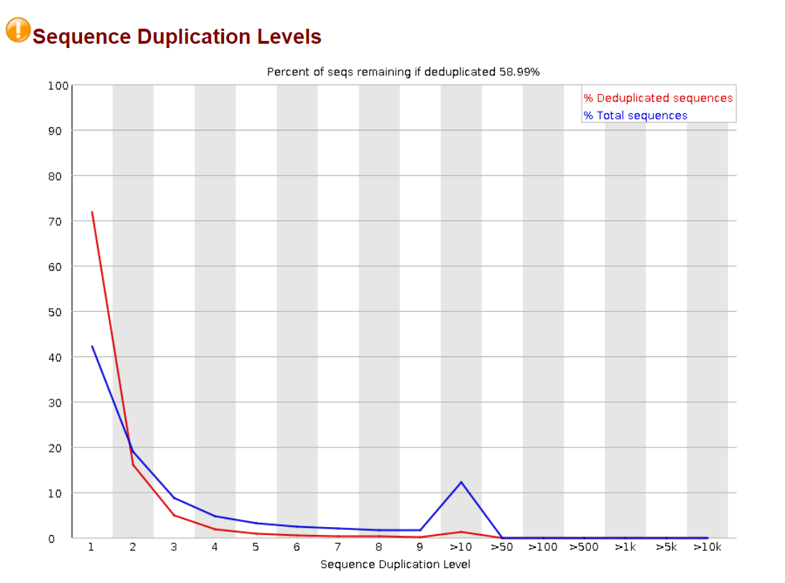

# Week 1

## Het doel/opzet van de cursus

Voor week 1 vind ik het belangrijk om duidelijk te krijgen wat het doel
is van deze cursus, aan de hand van de informatie op Blackboard ben ik
tot de volgende conclusie gekomen: het doel van deze course is om te
leren een pipeline te ontwikkelen, met behulp van Galaxy, die voor een
ziekte kan voorspellen of een patiënt mogelijk variaties heeft in zijn
genoom die aan de ziekte kunnen worden gelinkt. Ik heb samen met mijn
groepsgenoot gekozen voor '*medulloblastoma*' als aandoening. De reden
dat wij hiervoor hebben gekozen is omdat dit een van de meest
voorkomende vormen van kanker is bij jonge kinderen, maar er toch nog
maar weinig bekend is over de exacte oorzaak.

Vragen die wij willen onderzoeken zijn o.a.;

-   Welke SNP's er voorkomen bij medulloblastomen,

-   Welke tools wij het beste voor deze analyse kunnen gebruiken in Galaxy.

Voor deze analyse zullen wij de medulloblastoom DNA-seq data (MB-DNASeq)
gebruiken. Deze is terug te vinden op het BIN-netwerk in de volgende
locatie: /commons/Themas/Thema05/2024/. Deze data bevat 5 verschillende
samples, waarvan wij de sample van patiënt 5 zullen gebruiken
(SRR26913194). De data voor deze sample bestaat uit 2 FASTQ-bestanden,
met de forward (\_1)- en reverse (\_2) read, de data bestaat uit
next-generation Illumina NextSeq 500 reads (paired-end) en bestaat uit
de exomen van bepaalde genen in een vooraf opgesteld genpanel. Dit
genpanel bevat 130 genen die met het ontstaan van kanker in verband
worden gebracht. Door een 'klein' genpanel op te stellen van 130 genen,
in plaats van alle 26.564 menselijke genen te sequencen, kunnen er meer
reads worden verkregen van de genen die daadwerkelijk interessant zijn
bij het ontstaan van deze aandoening.

De applicaties die wij voor dit project zullen gebruiken zijn:

-   De wetenschappelijke workflow manager Galaxy, voor de analyse,
-   R voor het bijhouden van de bevindingen en de manier waarop de
    analyse is uitgevoerd, dit vind plaats in de vorm van een logboek,
-   Github voor het delen van bestanden.

De tools die wij op Galaxy zullen gebruiken om de analyse uit te voeren
zijn: - Quality Control: - FASTQC - Trimmomatic - Mapping: - BWA -
Variant detection: - LoFreq

## Achtergrondinformatie medulloblastoma

Voordat ik ben begonnen met het gebruik van Galaxy, heb ik informatie
opgezocht over medulloblastomen, om te achterhalen wat deze aandoening
inhoudt, op wie het vooral effect heeft en waarom het belangrijk is om
hier onderzoek naar te doen.

Medulloblastomen vormen de meestvoorkomende maligne hersentumor in
kinderen, namelijk bijna 20%. Medullablastomen zijn een embryonale
neuroepitheliale tumor in het cerebellum [afbeelding 1], dit houdt in
dat de tumor ontstaat vanuit bepaalde embryonale stamcellen. Behandeling
bestaat uit een combinatie van het chirurgisch verwijderen van de tumor,
met daarop volgend radio-en chemotherapie. De 5-jaar overlevingskans
lijkt nog niet heel duidelijk onderzocht en is volgens de literatuur
tussen de 20 en 90 procent. Deze grote range is te danken aan het feit
dat veel verschillende factoren een rol spelen bij de overlevingskans,
bijvoorbeeld de leeftijd wanneer de aandoening wordt vastgesteld, de
aanwezigheid van metastasen (uitzaaiingen) en afwijkingen in het genoom,
denk hierbij aan copy-number variations. Hierbij kan het zijn dat er van
bepaalde genen meer of minder kopieeen voorkomen, in het geval dat het
een gen is dat te maken heeft met bijvoorbeeld de celdeling, kan dit de
kans op kanker sterk verhogen. Medulloblastoom is een 'high-grade' tumor
(snel delend) en heeft een grote kans om uit te zaaien in het
hersenvocht [@Mahapatra2023].

Het is onbekend wat de oorzaak is van medulloblastomen, uit meerdere
onderzoeken blijkt dat er een mogelijke link is tussen het dieet van de
moeder tijdens de zwangerschap of de aanwezigheid van
auto-immuun/bloedziekten. Ook zijn bepaalde virale infecties mogelijk
een oorzaak, zoals virale John Cunningham infecties of human
cytomegalovirus infections tijdens kindertijd. Ook wordt er gedacht dat
erfelijkheid een rol speelt en dat bepaalde aandoeningen de kans
verhogen op het ontstaan van medullablastomen, dit zijn: Gorlinsyndroom,
Fanconi anemie, Turcotsyndroom, Li-Fraumeni syndroom [@Mahapatra2023].

Het is duidelijk dat er nog veel onbekend is over de exacte etiologie
van deze aandoening en juist omdat deze aandoening een van de meest
voorkomende vormen van kanker is bij (jonge) kinderen, denk ik dat het
maatschappelijk erg belangrijk is om hier verder onderzoek naar te doen.
In de literatuur wordt onder andere copy-number variation en
erfelijkheid vermeld, dit zijn beide onderdelen die kunnen worden
onderzocht door mapping aan de hand van een referentiegenoom.

![Weergave van locatie van medulloblastoom, in het cerebellum
[@MayoClinic2023]](medulloblastoom_img.webp){width="50%"}

## Galaxy tutorial

Nu ik een beter beeld heb gekregen van de aandoening heb ik besloten om
te beginnen met Galaxy, voordat ik aan de daadwerkelijke opdracht ben
begonnen heb ik een Galaxy tutorial gevolgd, om bekend te raken met de
workflow manager. De tutorial die ik hiervoor heb gebruikt is '*Galaxy
Basics for genomics*', afkomstig van de volgende website:
<https://galaxyproject.github.io/training-material/topics/introduction/tutorials/galaxy-intro-101/tutorial.html>

In deze tutorial heb ik geleerd om: - Een history aan te maken -
Bestanden in te laden - Tools te gebruiken (datamash, intersect
intervals, sort, select first, compare two datasets) - Een history om te
zetten naar een workflow

## Quality Control met Galaxy

### Input

Forward en reverse read van sample 5:

- SRR26913194_1.fastq 
- SRR26913194_2.fastq

| Input Parameter                                                     | Value                     |
|---------------------------------------------------------------------|---------------------------|
| Raw read data from your current history                             | 1: SRR26913194_1.fastq.gz |
| Contaminant list                                                    |                           |
| Adapter list                                                        |                           |
| Submodule and Limit specifing file                                  |                           |
| Disable grouping of bases for reads \>50bp                          | 0                         |
| Lower limit on the length of the sequence to be shown in the report | Not available.            |
| Length of Kmer to look for                                          | 7                         |

| Input Parameter                                                     | Value                     |
|---------------------------------------------------------------------|---------------------------|
| Raw read data from your current history                             | 1: SRR26913194_2.fastq.gz |
| Contaminant list                                                    |                           |
| Adapter list                                                        |                           |
| Submodule and Limit specifing file                                  |                           |
| Disable grouping of bases for reads \>50bp                          | 0                         |
| Lower limit on the length of the sequence to be shown in the report | Not available.            |
| Length of Kmer to look for                                          | 7                         |

### Output 

- Webpage
- Raw data

### Resultaten

#### Basic statistics

{width=400px}
{width=400px}

De basic statistics tussen de forward en reverse read lijken sterk met elkaar overeen te komen, op 1 onderdeel na, zo is het GC-gehalte bij de reverse read 1% lager en verwacht ik dat de GC-gehalte normaalverdeling bij de reverse read meer zal afwijken dan de forward read.

#### Summary
Wat opvalt in de summary van het FASTQC rapport voor zowel SRR26913194_1 als SRR26913194_2, is dat er een failure wordt gegeven bij '*per sequence GC content*' en een warning bij '*sequence duplication levels*'. Om te kijken wat dit betekent, ga ik kijken naar de documentatie van FASTQC.

 

#### Per sequence GC content
FASTQC meet het GC-gehalte van de gehele sequentie in een bestand en vergelijkt dit met een gemodelleerde normaalverdeling van het GC-gehalte. In een willekeurige library wordt er verwacht dat er ongeveer een normaalverdeling is van het GC-gehalte. Wanneer dit niet het geval is, en er een afwijkende vorm te zien is, kan dit wijzen op een probleem met de library. Een scherpe piek op de verdeling kan een gevolg zijn van een specifieke contaminant (bijv. van adapters), een bredere piek kan duiden op contaminatie met een andere soort. Een failure bij dit onderdeel houdt in dat de totale deviatie van de normaalverdeling gelijk is aan meer dan 30% van de reads [@FASTQC].

Bij het vergelijken van figuur .. en figuur .. met elkaar, valt het op dat de reverse read meer afwijkt van de normaalverdeling, zoals ik had verwacht. De reverse read lijkt 2 pieken te hebben.

#### Sequence duplication levels

Normaal horen sequenties maar één keer voor te komen in de uiteindelijke dataset, een lage hoeveelheid aan duplicaties van sequenties duidt op een hoge coverage van de target sequentie, maar een hoge hoeveelheid aan duplicaties kan het gevolg zijn van een bias. Deze module telt het aantal duplicaten voor elke sequentie in een library en maakt hiervan een plot, met het percentage van de sequentie en de bijbehorende hoeveelheid duplicaten. Hierbij Kijkt het alleen naar de eerste 100.000 sequenties van de data om geheugen te besparen, omdat dit genoeg is om een goed beeld te vormen. Dit onderdeel laat een warning zien als meer dan 20% van de data bestaat uit niet-unieke sequenties[@FASTQC]. 

Figuur .. en figuur .. lijken sterk op elkaar, bij beiden is er sprake van een piek bij sequence duplication level = >10. Een duidelijk verschil is dat het percentage overblijvende sequenties na dedupliceren 60.49% is voor de reverse read en 58.99% bij de forward read. Dit betekent dat de forward read 1.50% meer sequentie duplicaties heeft dan de reverse read.

Om de kwaliteit van de reads te verhogen maak ik gebruik van de Trimmomatic tool, deze pas ik toe op SRR26913194_1.fastq.gz en SRR26913194_2.fastq.gz (paired-end), met de volgende parameters:

| Input Parameter                                                                                         | Value                                       |
|--------------------------------------------------|----------------------|
| Single-end or paired-end reads?                                                                         | pair_of_files                               |
| Input FASTQ file (R1/first of pair)                                                                     | 1: SRR26913190_1.fastq.gz                   |
| Input FASTQ file (R2/second of pair)                                                                    | 2: SRR26913190_2.fastq.gz                   |
| Perform initial ILLUMINACLIP step?                                                                      | 1                                           |
| Select standard adapter sequences or provide custom?                                                    | standard                                    |
| Adapter sequences to use                                                                                | TruSeq3 (paired-ended, for MiSeq and HiSeq) |
| Maximum mismatch count which will still allow a full match to be performed                              | 2                                           |
| How accurate the match between the two 'adapter ligated' reads must be for PE palindrome read alignment | 30                                          |
| How accurate the match between any adapter etc. sequence must be against a read                         | 10                                          |
| Minimum length of adapter that needs to be detected (PE specific/palindrome mode)                       | 8                                           |
| Always keep both reads (PE specific/palindrome mode)?                                                   | 1                                           |
| Select Trimmomatic operation to perform                                                                 | SLIDINGWINDOW                               |
| Number of bases to average across                                                                       | 4                                           |
| Average quality required                                                                                | 20                                          |
| Select Trimmomatic operation to perform                                                                 | MINLEN                                      |
| Minimum length of reads to be kept                                                                      | 40                                          |
| Output trimlog file?                                                                                    | 0                                           |
| Output trimmomatic log messages?                                                                        | 0                                           |

De 'operations' die ik heb ingesteld zijn:

-   **SLIDINGWINDOW**: gaat met een window van 4 basen over de hele read
    heen, wanneer de gemiddelde kwaliteit binnen deze window lager is
    dan een Phred-score van 20, knipt hij de read en houdt hij het stuk
    met de hoogste kwaliteit.
    
-   **MINLEN**: behoudt de read niet wanneer deze korter is dan 40 (aangegeven MINLEN voor data met reads van 75bp).

